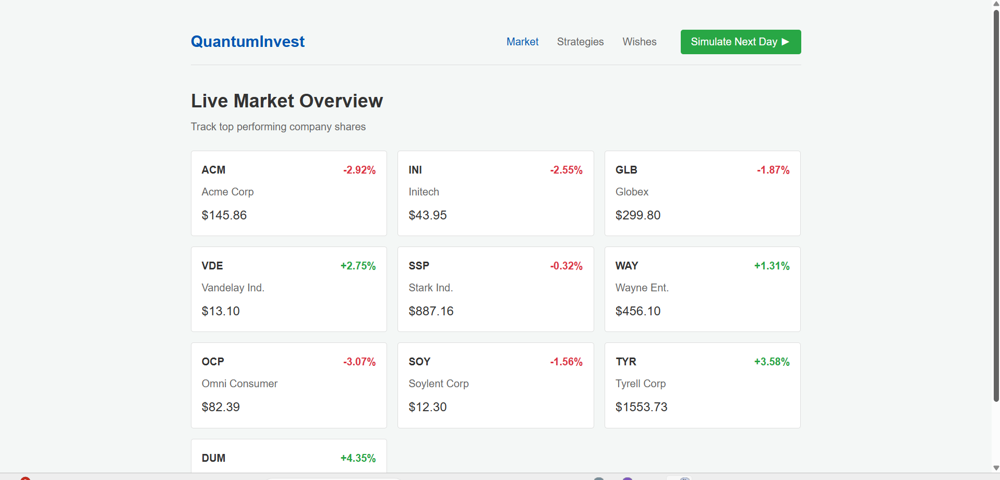
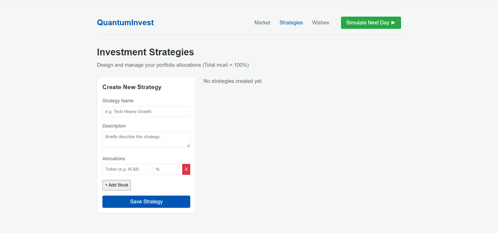
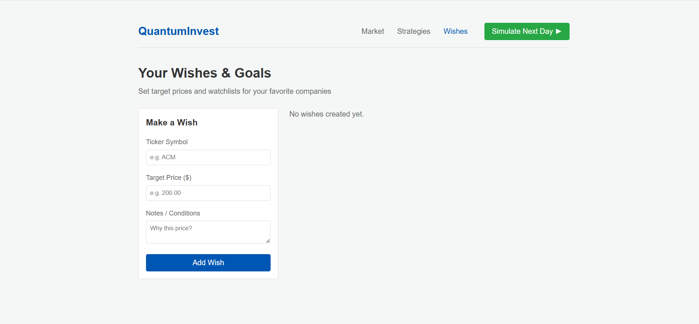

# QuantumInvest

QuantumInvest is a lightweight web application designed to help users simulate stock market investments, create portfolio strategies, and track their financial wishes.

## Overview

QuantumInvest provides a seamless, single-page application experience for managing theoretical stock market investments. It features a fully functional market simulation engine that mathematically evaluates portfolio performance over time.

### Key Features

*   **Live Market Simulation**: Track simulated companies and their current market performance. A simulation engine randomly fluctuates prices to mimic real market behavior.
*   **Dynamic Investment Strategies**: Design custom portfolio allocations by assigning percentage weights to specific companies. The application calculates profit, loss, and current portfolio value based on market fluctuations.
*   **Wishes & Goals**: Set target entry prices and keep a watchlist of companies of interest.
*   **Clean UI**: Built with a clean, light-themed, utilitarian interface.

## Application Screenshots

### Market Overview


### Strategy Builder


### Wishes & Watchlist


## Technology Stack

*   **Backend**: Python, Flask, Flask-SQLAlchemy
*   **Database**: SQLite (Configured for easy migration to PostgreSQL)
*   **Frontend**: Vanilla HTML, CSS, JavaScript
*   **Deployment**: Ready for Render deployment (includes `Procfile` and `requirements.txt`)

## Local Installation

1.  Clone the repository:
    ```bash
    git clone https://github.com/asg492607/-Anytime-Anywhere-Healthtech.git
    cd -Anytime-Anywhere-Healthtech
    ```

2.  Create and activate a virtual environment:
    ```bash
    python -m venv venv
    source venv/bin/activate  # On Windows: venv\Scripts\activate
    ```

3.  Install the required dependencies:
    ```bash
    pip install -r requirements.txt
    ```

4.  Run the application:
    ```bash
    python app.py
    ```

5.  Access the application in your browser at `http://127.0.0.1:5000`

## Production Deployment

This application is configured for deployment as a Web Service on Render. It utilizes `gunicorn` as the web server, which is defined in the included `Procfile`.
